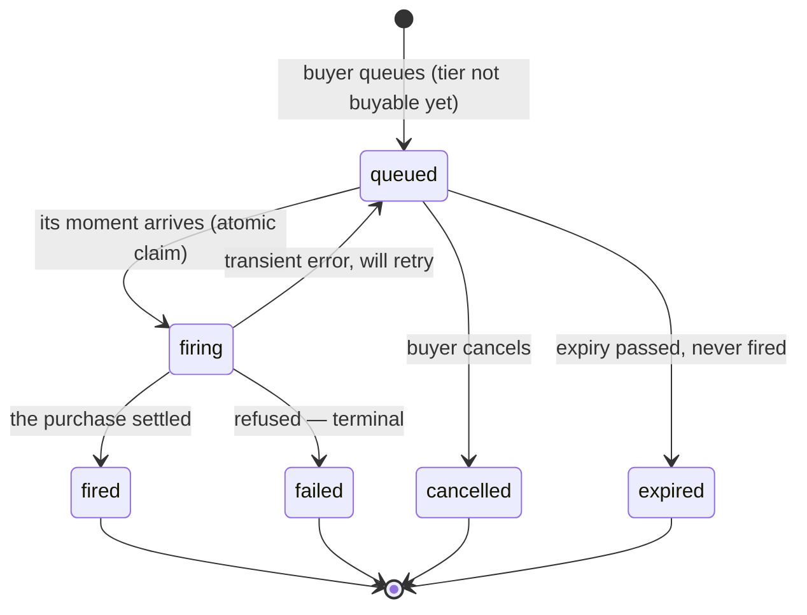
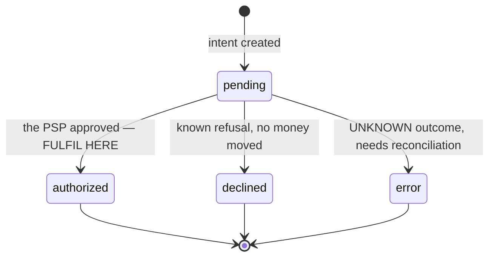

Most integration trouble is not transport or auth — it is holding a partial model
of what happens between "a buyer appoints an agent" and "a ticket is issued".
This page is that model, with the literal values you will see.

## The two objects

**A payment** is a purchase attempt that reached the money path. **A watch** is a
standing instruction to buy *later* — when a drop opens, or when a sold-out tier
is restocked. A buy-now purchase creates only a payment; a queued purchase
creates a watch that later creates a payment.

## Watch lifecycle

`status` is exactly one of: `queued` · `firing` · `fired` · `failed` ·
`cancelled` · `expired`.

**What fires a watch**: the tier becoming buyable.

- **You PATCH the tier** (`onSaleStart`/`onSaleEnd`/`availableCount`/`sellable`)
  so that it is buyable now — the PATCH schedules evaluation of that tier's
  queued watches without waiting for the periodic sweep.
- **A future-dated `onSaleStart` passes** with no PATCH at that moment — the
  scheduled sweep detects it on its next run (every five minutes in production).
  To get the immediate path for a timed drop, PATCH at the moment of opening.

Queued watches for a tier are processed one after another, each running the
full money path — quote, hold, a charge at your PSP. Purchase-start and
webhook-delivery times therefore depend on queue position, PSP responses and
delivery attempts; plan for seconds, not milliseconds, and do not infer failure
from a short wait. You do not need to tell us to fire a watch, and there is no
separate call to do so.

**`failed` is terminal.** A refusal produced by the buyer's own mandate — spend
cap, quantity guardrail, scope — will never succeed on retry, so we do not retry
it, and the watch leaves the queue. Only genuinely transient errors return a
watch to `queued`. This is why a failed watch "disappears": it is finished. You
receive [`watch.failed`](/guides/webhooks) with the reason so you can tell the
buyer.

## Payment lifecycle

`status` is exactly one of: `pending` · `authorized` · `declined` · `error`.

- **Fulfil on `authorized`**, and only on `authorized`. For ticketing it is
  terminal: the seat is sold, the buyer's authority is consumed, and the funds are
  captured to your PSP moments later.
- **`error` is not a decline.** It means the outcome is genuinely unknown (a
  timeout mid-charge). The money may or may not have moved, so the seat stays
  held and the buyer's allowance stays consumed until a human reconciles it
  against the PSP. Never treat it as a failure, and never retry it as a fresh
  purchase.
- A row can read `pending` for a second or two before its result lands — which is
  why a poller must not advance its cursor past a non-terminal row. Webhooks have
  no such race: they fire only once the payment is authorized.

## Telling the five common cases apart

| Symptom | What it actually means | Where to look |
|---|---|---|
| Watch vanished, no payment | Fired and was **refused** (terminal) | the `watch.failed` event's `reason` |
| Watch sits `queued` after a drop | The tier is not buyable to us yet — stock, sale window, or `sellable` | PATCH the tier; confirm our copy, not just yours |
| No watch was ever created | The tier was already on sale, so the page offered **Buy now**, not Queue | a watch only exists when there is something to wait for |
| Payment exists, no ticket issued | Your fulfilment branch — check you key on `intentId` and branch on `type` | your logs, then `GET /v1/integration/payments/{intentId}` |
| `authorized` but funds not captured | Capture follows the confirm within moments | the payment's event trail |

## When you are stuck

`GET /v1/integration/payments/{intentId}` returns the intent, the result, and the
**full durable event trail** — every routing attempt, refusal and capture, in
order. That trail is the authoritative account of what happened, and it is
readable with the same merchant token you already hold: you should not need to
ask us to query a database.
